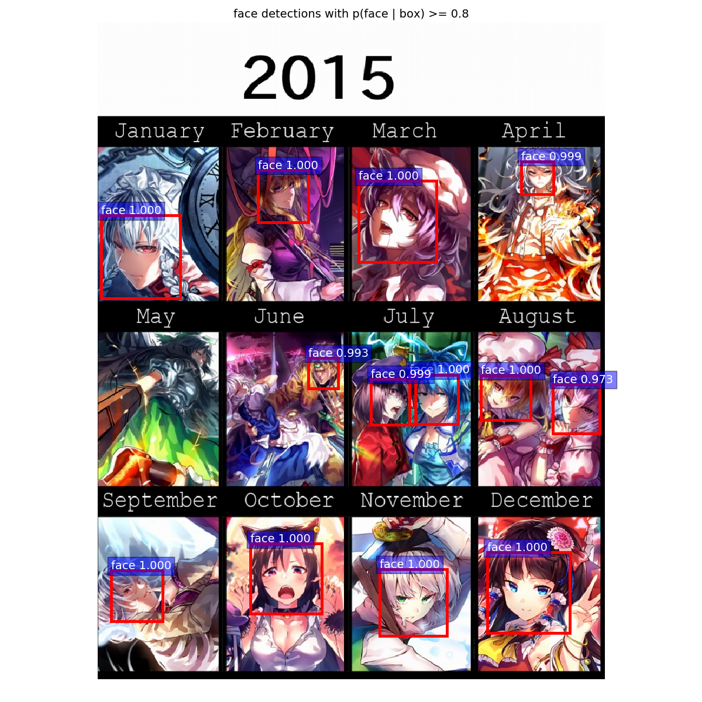
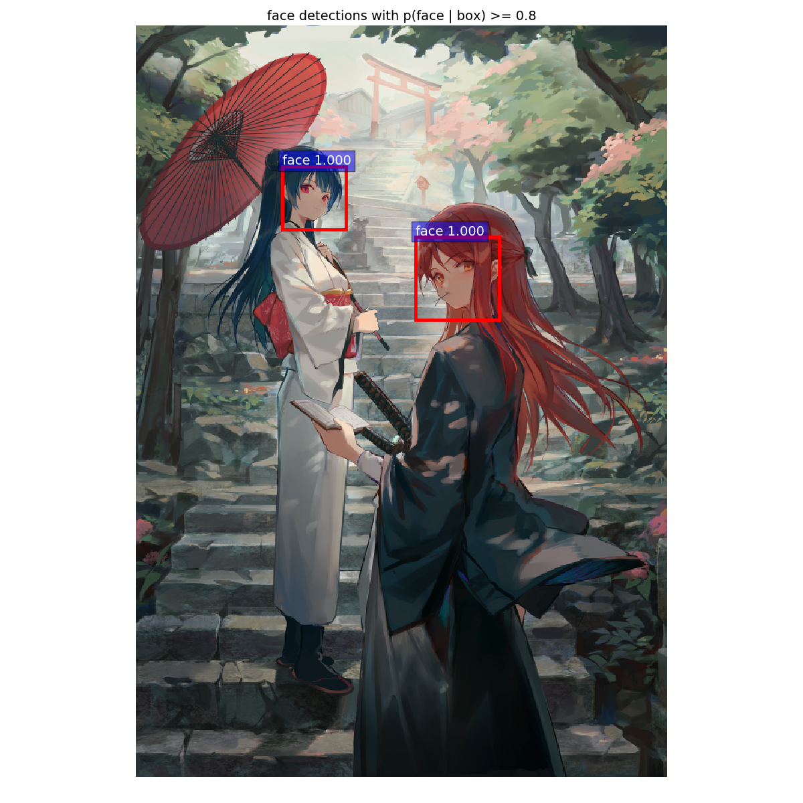
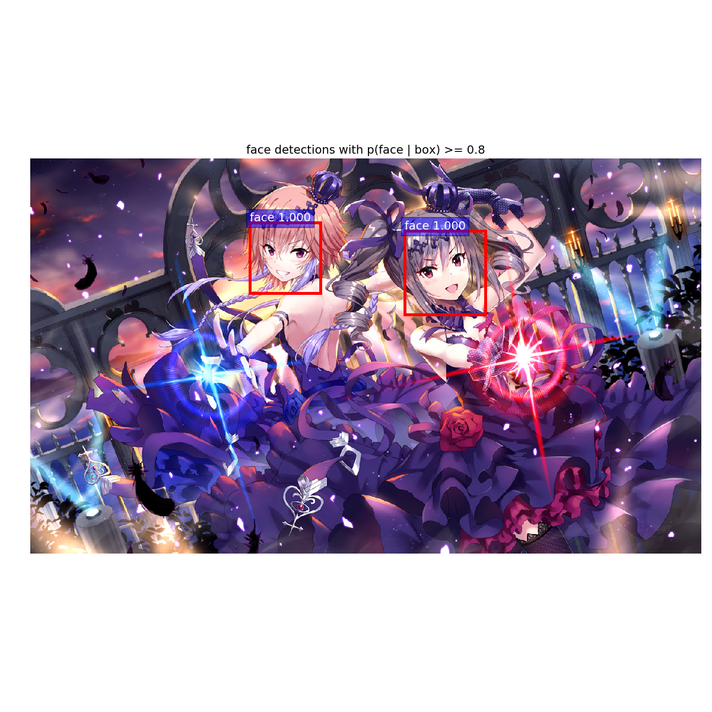

# Anime-Face-Detector
A Faster-RCNN based anime face detector.

This detector is trained on 6000 training samples and 641 testing samples, randomly selected from the dataset which is crawled from top 100 [pixiv daily ranking](https://www.pixiv.net/ranking.php?mode=daily).  

Thanks to [OpenCV based Anime face detector](https://github.com/nagadomi/lbpcascade_animeface) written by nagadomi, which helps labelling the data. 

The original implementation of Faster-RCNN using Tensorflow can be found [here](https://github.com/endernewton/tf-faster-rcnn)

## Dependencies
- Python >= 3.6
- `tensorflow` latest 1.x or 2.x
- `opencv-python` (Will use other packages like `pillow` and `scikit-image` as backend in future version)
- `cython` (optional, can be ignored with additional `-nms-type PY_NMS` argument)
- Pre-trained ResNet101 model

## Usage
1. Clone this repository
    ```bash
    git clone https://github.com/qhgz2013/anime-face-detector.git
    ```
2. Download the pre-trained model  
    Google Drive: [here](https://drive.google.com/open?id=1WjBgfOUqp4sdRd9BHs4TkdH2EcBtV5ri)    
    Baidu Netdisk: [here](https://pan.baidu.com/s/1bvpCp1sbD7t9qnta8IhpmA)  
3. Unzip the model file into `model` directory
4. Build the CPU NMS model (skip this step if use PY_NMS with argument: `-nms-type PY_NMS`)
    ```bash
    make clean
    make
    ```
   If using Windows Power Shell, type `cmd /C make.bat` to run build script.
5. Run the demo as you want
    - Visualize the result (without output path):
        ```bash
        python main.py -i /path/to/image.jpg
        ```
    - Save results to a json file
        ```bash
        python main.py -i /path/to/image.jpg -o /path/to/output.json
        ```
        Format: `{"image_path": [{"score": predicted_probability, "bbox": [min_x, min_y, max_x, max_y]}, ...], ...}`
        Sample output file:
        ```json
        {"/path/to/image.jpg": [{"score": 0.9999708, "bbox": [551.3375, 314.50253, 729.2599, 485.25674]}]}
        ```
    - Detecting a whole directory with recursion
        ```bash
        python main.py -i /path/to/dir -o /path/to/output.json
        ```
    - Customize threshold
        ```bash
        python main.py -i /path/to/image.jpg -nms 0.3 -conf 0.8
        ```
    - Customize model path
        ```bash
        python main.py -i /path/to/image.jpg -model /path/to/model.ckpt
        ```
    - Customize nms type (supports CPU_NMS and PY_NMS, not supports GPU_NMS because of the complicated build process for Windows platform)
        ```bash
        python main.py -i /path/to/image.jpg -nms-type PY_NMS
        ```
    - Crop detected images and store them in a folder (start output is an integer to start naming the cropped images, default is 0)
        ```bash
        python main.py -i /path/to/image/or/folder -crop-location /path/to/store/cropped/images -start-output 1
        ```
    - Crop detected images and resizes them
        ```bash
        python main.py -i /path/to/image/or/folder -crop-location /path/to/store/cropped/images -crop-height 224 -crop-width 224
        ```

## Results
**Mean AP for this model: 0.9086**


Copyright info: [東方まとめ](https://www.pixiv.net/member_illust.php?mode=medium&illust_id=54275439) by [羽々斬](https://www.pixiv.net/member.php?id=2179695)


Copyright info: [【C94】桜と刀](https://www.pixiv.net/member_illust.php?mode=medium&illust_id=69797346) by [幻像黒兎](https://www.pixiv.net/member.php?id=4462245)


Copyright info: [アイドルマスター　シンデレラガールズ](https://www.pixiv.net/member_illust.php?mode=medium&illust_id=69753772) by [我美蘭＠１日目 東A-40a](https://www.pixiv.net/member.php?id=2003931)

## About training

This model is directly trained by [Faster-RCNN](https://github.com/endernewton/tf-faster-rcnn), with following argument:
```bash
python tools/trainval_net.py --weight data/imagenet_weights/res101.ckpt --imdb voc_2007_trainval --imdbval voc_2007_test --iters 60000 --cfg experiments/cfgs/res101.yml --net res101 --set ANCHOR_SCALES "[4,8,16,32]" ANCHOR_RATIOS "[1]" TRAIN.STEPSIZE "[50000]"
```

## Dataset

We've uploaded the dataset to Google drive [here](https://drive.google.com/open?id=1nDPimhiwbAWc2diok-6davhubNVe82pr), dataset structure is similar to VOC2007 (used in original Faster-RCNN implementation).

## Citation and declaration

Feel free to cite this repo and dataset.  
This work is not related to my research team and lab, just my personal interest.
